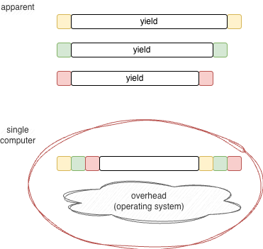
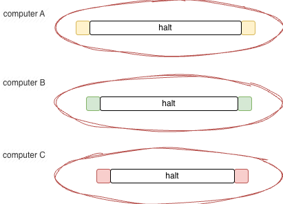

# Concurrency Is Not Parallelism

**TL;DR** In casual English, "concurrency" and "parallelism" are used interchangeably. In computer science, the distinction is precise and consequential. Synchronous functions cannot — as in _impossible_ — express asynchronous activities. Multi-threading fakes parallelism; PBP (0D) designs software that is ready for true parallelism from the start.

---

# L;R

# Analogy

Consider what a data _record_ looks like in memory:

A struct (class, record) written in code looks benign. Mapped onto 64-bit hardware and emitted as aligned data, gaps appear in the memory layout between fields.

Some languages and compilers allow programmers to "pack" the data to eliminate those gaps. This saves memory but costs compute cycles, because the CPU works harder to access data not aligned on 64-bit boundaries.

The same phenomenon appears in multi-threading — except the gaps are in the dimension of _time_, not space. The principle is identical: optimization choices in one dimension create costs in another.

# Multi-Threading Fakes Parallelism

Each "thread" is an isolated function. Such functions call other functions within the same thread in a synchronous, sequential manner.

Extra software — the operating system — divvies up CPU time and hands slices of it to all threads running on the same machine.

This happens fast enough that humans perceive the threads as running in parallel. They are not. They run sequentially, and slower than they could, due to the overhead of the operating system.

We have been extracting performance from this model by adding complex caches, multiple cores, and cache coherency logic. Code running in the L1 caches of separate cores can run in parallel, but becomes sequential and synchronous the moment it accesses data outside those caches. One machine does not run multiple threads in a truly parallel manner.

# True Parallelism Requires Dedicated CPUs

True parallelism means one CPU per thread. In that case, no operating system overhead is needed on each machine.

This was the goal of hardware architects in the early days of computing. CPUs and whole computers were too expensive to justify it then.

Today, CPUs are cheap. Arduinos, ESP32s, and Raspberry Pis are cheap. The economic justification for complicated software that squeezes cycles out of shared hardware is gone.

The internet already works this way. Internet nodes are separate, totally isolated computers that run at their own speed and exchange blobs of data as messages.

We continue using old-fashioned shared-memory ideas because, as [Grace Hopper](https://programmingsimplicity.substack.com/p/capt-grace-hopper-on-future-possibilities?r=1egdky) put it, "we've always done it this way".

# PBP — Parts-Based Programming

PBP (0D) simulates software meant to run in parallel, on a single machine, in a way that is ready to split off onto separate machines.

The key fact: synchronous functions cannot express asynchronous activities. Fake parallelism expressed as concurrency in the functional paradigm works the way Disney cartoons work — by fooling human perception into seeing motion that is not there.

In the early days of stand-alone computers, we chose small-grained memory sharing over message passing. The earliest symptom of that choice was "thread safety". Symptoms have been popping up in whack-a-mole fashion ever since — callback hell, the Mars Pathfinder fiasco — and each time, we applied a band-aid instead of fixing the basic problem. The problems of thread safety evaporate when isolated computers are used. Programming complexity drops when thread safety no longer inflicts itself on thought patterns, language design, and operating system architecture.

Early cartridge-based gaming systems had no operating systems and were fundamentally simpler to program. The invention of the operating system was a soft substitute for a machine with multiple slots, each with its own isolated CPU, with mechanical switches to route shared hardware resources — displays, keyboards, joysticks — between programs. We built the switch in software and called it an OS. PBP goes back to the hardware intuition: isolated components, explicit wiring, message passing. No shared memory. No thread safety. No operating system required.

# See Also

_Email_: [ptcomputingsimplicity@gmail.com](mailto:ptcomputingsimplicity@gmail.com) 
_Substack_: [paultarvydas.s. bstack.com](http://paultarvydas.substack.com/) 
_Videos_: [https://www. youtube.com/@programmingsimplicity2980](https://www.youtube.com/@programmingsimplicity2980) 
_Discord_: [https://discord.gg/65YZUh6J. q](https://discord.gg/65YZUh6Jpq)  
_Leanpub_: [https://leanpub.com/u/paul-tarvydas](https://leanpub.com/u/paul-tarvydas)  
_Twitter_: @paul_tarvydas  
_Bluesky:_ @paultarvydas.bsky.social  
_Mastodon:_ @paultarvydas  
_(earlier) Blog:_ [guitarvydas.github.io](http://guitarvydas.github.io/)  
_References:_ [https://guitarvydas.github.io/2024/01/06/References.html](https://guitarvydas.github.io/2024/01/06/References.html)

_Paid subscriptions are a voluntary way to support this work._