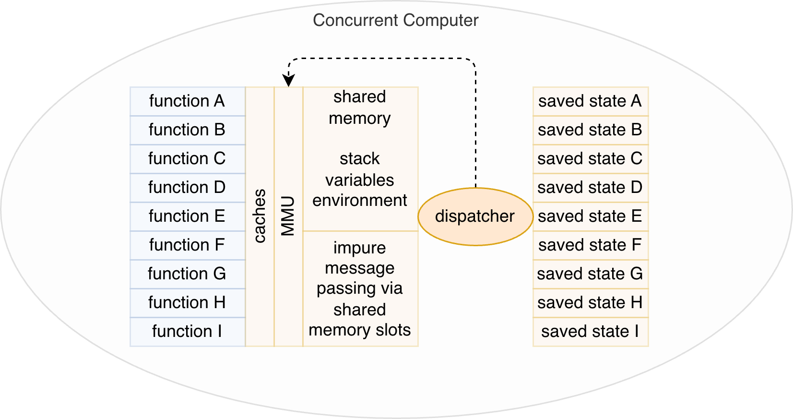
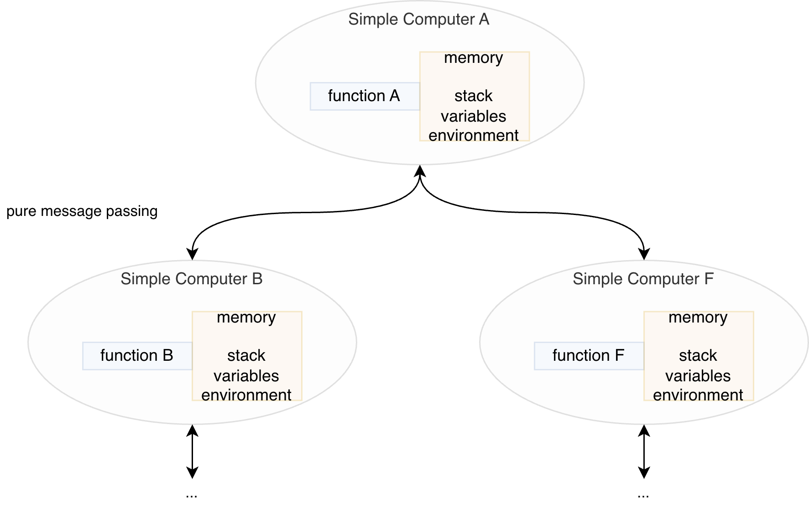

# Concurrency (Part 1 of 2)
2026-06-24

Simplified sketches that show the difference between concurrency and pure message passing.

## Computer With Concurrency

A simplified sketch. Note that functions (A-I) might be one function or a tightly coupled thread of functions calling functions (which is really just one big function).

Not shown: all sorts of complicated extra code that belongs to the dispatcher and operating system.

Threads run more slowly than they could due to time-slicing and due to operating system overhead.

This only *simulates* parallelism using a mechanism that is unrealistic for geographically distributed systems, i.e. memory sharing. In addition, the simulation assumes that the processes are automagically synchronized (via memory sharing and cache coherency and extra hardware).

Each program (functions A-I) is actually a state machine. Programmers do not get to easily control and architect this behaviour. Context switching is performed by algorithms buried in the operating systems.

## System With Pure Message Passing

Not shown: code that polls (or reacts to) incoming messages on input ports.

This can be simulated on a single development system by ensuring that programs cannot share memory.

Each program gets almost 100% of each separate CPU, hence, runs more quickly than on time-shared machines.
# See Also

_Email_: [ptcomputingsimplicity@gmail.com](mailto:ptcomputingsimplicity@gmail.com)\
_Substack_: [paultarvydas.s. bstack.com](http://paultarvydas.substack.com/)\
_Videos_: [https://www.  youtube.com/@programmingsimplicity2980](https://www.youtube.com/@programmingsimplicity2980)\
_Discord_: [https://discord.gg/65YZUh6J.  q](https://discord.gg/65YZUh6Jpq)\
_Leanpub_: [https:. /leanpub.com/u/paul-tarvydas](https://leanpub.com/u/paul-tarvydas)\
_Twitter_: @paul_tarvydas\
_Bluesky:_ @paultarvydas.bsky.social\
_Mastodon:_ @paultarvydas\
_(earlier) Blog:_ [guitarvydas.github.io](http://guitarvydas.github.io/)\
_References:_ [https://guitarvydas.github.io/2024/01/06/References.html](https://guitarvydas.github.io/2024/01/06/References.html)\

_Paid subscriptions are a voluntary way to support this work._