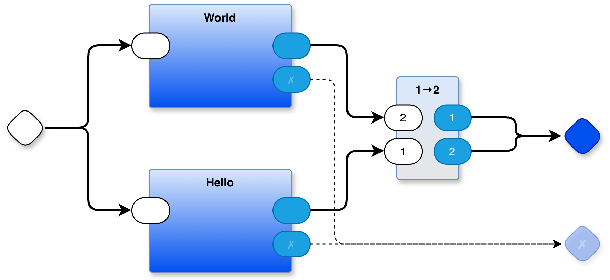
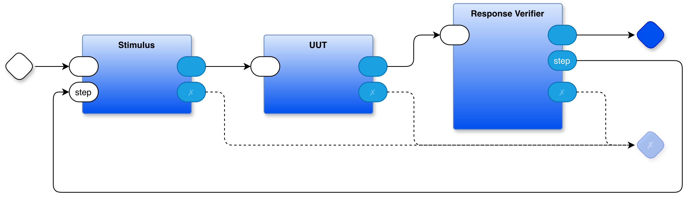

# The Parts Based Programming Kernel

_July 1, 2026_

---

Every system has a kernel — the irreducible core that makes everything else possible. For operating systems, it's the code that loads programs, manages memory, and controls the CPU. For Parts Based Programming (PBP), the kernel is simpler: two things.

1. A template registry.
2. Coroutining.

That's it. Let me explain what that means and why it matters.

---

## A Simulation of Isolation

The PBP kernel runs on a single development computer, but what it simulates is a set of fully isolated, asynchronous components — each with its own private state, communicating only by passing messages.

This is a deliberate design choice, not a limitation. The shared-memory model that underlies conventional operating systems works fine on a single machine, but it breaks down badly when you try to scale across geography. You can't share memory between machines in Tokyo and Toronto. You can pass messages. If you write your software from the start using PBP's isolated-component model, it scales to distributed systems naturally — because the architecture never assumed shared memory in the first place.

---

## What the Kernel Does

When you draw a diagram in PBP, that diagram _becomes_ a template. Boxes become parts. Connections become message routes. The visual is the program.

A single drawio file can contain many drawings, each on a separate editor tab. Each drawing is a Container part. Any part on a drawing that doesn't correspond to another drawing is assumed to be a Leaf part — an atomic component that does actual work without containing other parts. Containers are converted by `das2json` into machine-readable JSON that lists their children and the routing between them. Leaf parts are simply assumed to exist — assumed to be imported by the main program (e.g. `main.py` when Python is the host language).

When a PBP system starts up, it does three things in sequence:

**First, it loads all the templates.** Container parts are loaded from those JSON files. Container parts are automatically registered when their JSON is read. Leaf parts must be declared in code using `mkTemplate(...)` and explicitly registered with `register_component(...)`. All Leaf parts must be registered before the system can run.

**Second, it instantiates.** Starting from the top-most Container, the runtime recursively creates unique instances of every part, all the way down through the hierarchy to the leaves.

**Third, it runs.** The top-most Container walks its children. Each Container processes one input message-event (mevent) at a time, ticking each child in a loop until that child has no more work to do. Containers can hold Containers, so this walk is recursive. When you hit a Leaf, the recursion stops — Leaves don't contain anything; they just act.

This is a clean, explicit, traceable execution model. No surprises.

---

## Sound Familiar? It Should.

This is almost exactly what an operating system does — and coroutining is what OSes do _under the hood_.

An OS loads a program: reads the object file (`.obj`, `.o`, or whatever), fixes up addresses, tweaks the MPU, then hands control to the code. That's the registry and instantiation steps. Then the OS scheduler takes over — and the scheduler is, at its core, a coroutine manager.

The scheduler keeps a list of ready threads and algorithmically picks one to run. It then does something remarkable: it saves the entire state of the currently running thread — registers, stack pointer, program counter — into a privileged block of OS memory, loads the saved state of the chosen thread, sets a hardware timer, and _yields_ to it. From that thread's point of view, it simply resumed. When the timer fires, an OS interrupt handler forces the thread to yield back to the scheduler, and the cycle repeats.

Each thread looks like a plain function (or a chain of functions), but it is actually a state machine whose state is being saved and restored by the scheduler on every context switch. The OS is doing coroutining, just wrapped in layers of hardware privilege management, timer interrupts, and memory protection machinery.

PBP makes the coroutining explicit and visible, without the machinery.

---

## The 20th Century Tax

Operating systems got this complicated to solve a specific 1960s problem: CPUs were expensive. One CPU, many users. You had to time-share.

Time-sharing is where the complexity explosion happened. If you have 10 apps and 90 OS threads running, each app gets roughly 1/100th of a CPU — give or take, modulo complicated priority management, scheduling queues, and preemption logic. The software architect doesn't get to control any of it. Start a new app or thread and it silently steals cycles from everything already running.

This also gave us "thread safety" — an entire category of bugs that exists solely because multiple threads share memory on a single CPU. Mutexes, semaphores, lock-free data structures, memory barriers. Enormous bodies of engineering work devoted to managing a problem manufactured by 1960s economics. Race conditions are particularly nasty because they aren't just hard to reproduce — they're hard to _reason about_. The program's behavior depends on timing relationships that aren't visible in the code.

The cleaner model: a zillion totally isolated CPUs, each with its own private memory, each running exactly one thread, communicating only by passing messages. No scheduling. No shared memory. No thread safety. No shared-memory race conditions — and when ordering matters, it's visible in the diagram, not buried in hardware timing. The complexity evaporates — not because of clever engineering, but because the source of the complexity was never necessary in the first place.

CPUs used to cost as much as a house. So we built six decades of software around the assumption that we'd only ever have one.

---

## What PBP Is About

That assumption no longer holds.

CPUs are cheap. The economics that forced the shared-memory, time-sliced model onto us have reversed. And yet we keep writing software as if we're still rationing a single VAX.

PBP is not about managing cores or squeezing performance out of on-chip cache coherency hardware. It's a way to think about multi-processing using the simplest possible model: multiple full-blown, totally isolated CPUs with private memory, passing messages between them. On a development machine, the PBP kernel simulates this with coroutining. In production, you can deploy the same architecture across genuinely separate machines, because the model never assumed anything else.

The kernel is simple because the model is simple. A registry, and coroutining. That's all you need to build things that reflect how you actually think about them — rather than how a 1960s time-sharing system happened to organize them.

We didn't have to make software this complicated. We can stop.

---

## Examples

### Simplest Hello World That Guarantees Mevent Order

### Test Jig

### Kernel Code Generator
The PBP kernel is generated from a layered diagram containing some 40 parts. This is but one of the layers.

---

## Raw Notes
The above was cowritten with Claude. My initial concise notes are below:

[initial notes](https://github.com/guitarvydas/napkin-notes/blob/main/2026-07-01/1.%20PBP%20Kernel.md)\
[comments regarding first draft](https://github.com/guitarvydas/napkin-notes/blob/main/2026-07-01/3.%20Notes%20re.%20PBP%20Kernel.md)\

---

## Further
[Towards Parts Based Programming](https://www.youtube.com/watch?v=IFcIptdG2sY&list=PLHh2_dCKBPjYBmubkBfn0LSbDMRKsr9Ui)\
[PBP cookbook playlist](https://www.youtube.com/watch?v=EFTzFA82YRc&list=PLHh2_dCKBPjbBN2R8xwBiS4nHlo5iQjqS)\
[Decision Tree Diagram Transmogrifier](https://www.youtube.com/playlist?list=PLHh2_dCKBPjYhpvWSvJNJdrsZE8lNHza7)\
[State Machine Diagram Tool](https://www.youtube.com/watch?v=ecJGkrpUhQQ&list=PLHh2_dCKBPjZEvCymkt1ZVualP7gt3e1O&index=17)\

[FDD LLM - 5 Whys Tool - code repository](https://github.com/guitarvydas/fdd-llm)\
[State Machine Tool - code repository](https://github.com/guitarvydas/sm-pbp)\
[Decision Tree Tool - code repository](https://github.com/guitarvydas/dtree)\
[PBP all tools (PBP, T2T, das2json)](https://github.com/guitarvydas/pbp)\

[The Spherical Cows of Programming](https://programmingsimplicity.substack.com/p/the-spherical-cows-of-programming)\
[The Wrong Spherical Cow - First Principles of Parts Based Programming](https://programmingsimplicity.substack.com/p/the-wrong-spherical-cow-first-principles?r=1egdky)\
[The Case For Composable Notations (1 / 5) - The Spherical Cow We Forgot We Were Riding](https://programmingsimplicity.substack.com/p/the-spherical-cow-we-forgot-we-were?r=1egdky)\
[The Case For Composable Notations (2 / 5) - The Restrictions That Came With The Cow](https://programmingsimplicity.substack.com/p/the-case-for-composable-notations?r=1egdky)\
[The Case For Composable Notations (3 / 5) - State Isn’t The Enemy](https://programmingsimplicity.substack.com/p/the-case-for-composable-notations-e6c?r=1egdky)\
[The Case For Composable Notations (4 / 5) - Ease of Expression Is the Whole Point](https://programmingsimplicity.substack.com/p/the-case-for-composable-notations-2bd?r=1egdky)\
[The Case For Composable Notations (5 / 5) - UNIX Already Showed Us the Way](https://programmingsimplicity.substack.com/p/the-case-for-composable-notations-f31?r=1egdky)\
[The Case For Composable Notations (6 / 5) - WIP - Notations in Progress](https://programmingsimplicity.substack.com/p/the-case-for-composable-notations-0d3?r=1egdky)\

## See Also

_Email_: [ptcomputingsimplicity@gmail.com](mailto:ptcomputingsimplicity@gmail.com)\
_Substack_: [paultarvydas.s. bstack.com](http://paultarvydas.substack.com/)\
_Videos_: [https://www.  youtube.com/@programmingsimplicity2980](https://www.youtube.com/@programmingsimplicity2980)\
_Discord_: [https://discord.gg/65YZUh6J.  q](https://discord.gg/65YZUh6Jpq)\
_Leanpub_: [https:. /leanpub.com/u/paul-tarvydas](https://leanpub.com/u/paul-tarvydas)\
_Twitter_: @paul_tarvydas\
_Bluesky:_ @paultarvydas.bsky.social\
_Mastodon:_ @paultarvydas\
_(earlier) Blog:_ [guitarvydas.github.io](http://guitarvydas.github.io/)\
_References:_ [https://guitarvydas.github.io/2024/01/06/References.html](https://guitarvydas.github.io/2024/01/06/References.html)\

_Paid subscriptions are a voluntary way to support this work._