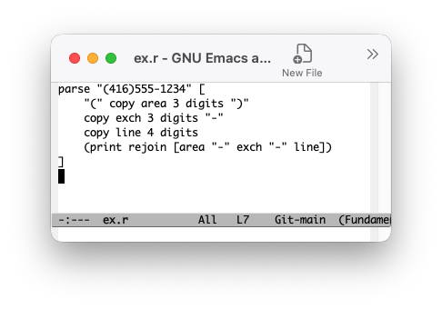
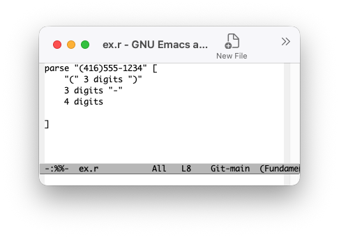

# Experiment — Projectional Viewer
2026-08-26

## Purpose

Modern programming languages bury structure under implementation detail. The signal-to-noise ratio is too low — there's too much _how_ cluttering up the _what_ — and that makes it hard to reason about anything beyond fairly simple problems.

This experiment asks whether implementation detail can be elided from code, rather than removed. The detail stays in the source; it's just toggled out of view in the editor. The goal is a clearer picture of a solution's structure, without having to wade through the mechanics of how that structure gets executed.

The immediate irritant was PEG (parsing expression grammar) libraries. I know grammars reasonably well, and most PEG implementations I've used smear the grammar itself under a layer of code for capturing and acting on matches during and after the parse. The grammar — the actual structure of what's being recognized — disappears into the plumbing.

A full round-trip projectional editor, where you edit the elided view and it writes back to the source, is hard to build well. So this experiment settles for a one-way trip: elide the detail for reading, without trying to support editing the elided form. The question is whether that lesser goal is easy to reach and still worth having.

Underlying this is a way of treating a "grammar" as a DSL for pattern matching — one little language embedded in another. If eliding works here, it suggests a broader path: composing many small special-purpose languages into a single codebase, instead of forcing every concern through one general-purpose paradigm.

## Method

I started from a small, real example: a phone-number grammar written in Rebol, implementation detail and all.

```
parse "(416)555-1234" [
    "(" copy area 3 digits ")"
    copy exch 3 digits "-"
    copy line 4 digits
    (print rejoin [area "-" exch "-" line])
]
```

The `copy area`, `copy exch`, `copy line`, and the trailing `(print rejoin ...)` block are all implementation detail — they're about capturing values and doing something with them, not about the shape of a valid phone number. Stripped of that, the grammar itself is just:

```
parse "(416)555-1234" [
    "(" 3 digits ")"
    3 digits "-"
    4 digits
]
```

To get from one to the other automatically, I had Claude Sonnet 5 Code write an Emacs Lisp file, `pelide-view.el`, that shells the buffer (or region) out to a small pipeline built on T2T: an OhmJS parser followed by RWR rewrite semantics. The pipeline reads the annotated source and hands back the elided grammar, which the elisp code then displays back in the editor.

The grammar for the pipeline's parser (`pelide.ohm`) and its rewrite rules (`pelide.rwr`) are in the appendix, as is the generated `pelide-view.el`. The rest of the code lives in the [github repo](https://github.com/guitarvydas/rebol).

Given the time available, I only ran this against the one example above. Whether it generalizes to messier grammars is an open question.

To reproduce it: eval and load `pelide-view.el`, load `ex.r` into Emacs, then hit `C-c p t` to toggle into the elided view, and again to toggle back.

## Observations

The pipeline did what it was supposed to: it elided the `copy` clauses and the trailing action block, and left behind the bare grammar shown above. Toggling back and forth in Emacs worked as expected.


Under the hood, this is my T2T transmogrifier technology at work: OhmJS does the parsing, and a custom DSL I call RWR does the filtering, rewriting, and eliding. The result is handed back to Emacs for read-only viewing.

## Conclusions

Even from this one example, the elided grammar reads better than the annotated original — it's easier to see, at a glance, what pattern is actually being matched. That's a good sign for the general idea.

It's a small enough result that I'd want to try it against more grammars before drawing strong conclusions, but it seems worth pursuing. A natural next step would be writing elision grammars for other, more current PEG implementations — Lua's and Janet's come to mind.

This also suggests that using T2T as a filter is fast and usable enough on modern hardware — the lag when toggling is almost imperceptible. I don't expect that to change as long as we keep the little languages little: there's no need to write grammars for Turing-complete behemoths here, since small code snippets are all that's required.

The experiment also points at a follow-on problem worth tackling: writing grammars that can detect the presence of elidable code within a larger file, rather than assuming the whole file is a single elidable unit.

### Further ideas: composing many little languages instead of one paradigm

This experiment is one piece of a larger question: how do you let many small DSLs coexist inside a single project, instead of forcing everything through one general-purpose language?

One direction already underway is transmogrification rather than elision: writing in a small meta-language and generating standard target languages from it. The PBP kernel is built this way — three source files (`0d.rt`, `stock.rt`, `jit.rt`) written in the `.rt` meta-language, currently transmogrified into Python, JavaScript, and Common Lisp. The transmogrifier itself works (see the [kernel repo](https://github.com/guitarvydas/pbp/tree/main/kernel) for details), but I haven't yet run the projectional-viewing experiment against it.

A further-out direction is diagrammatic programming: generating code snippets from a diagrammatic programming language (DPL) rather than text. There are small, early examples of this using drawio — a [decision-tree repo](https://github.com/guitarvydas/dtree) and a [state-machine repo](https://github.com/guitarvydas/sm-pbp) — but again, the elision experiment hasn't been done against them, and it isn't even clear yet how drawio would couple to Emacs.

---

## Appendix — Generated `pellide-view.el` Code

```lisp
;;; pellide-view.el --- Shell out to PELLIDE for a condensed view -*-
;;; lexical-binding: t; -*-

(defgroup pellide-view nil
  "Shell buffer/region out to the PELLIDE tool for a condensed view."
  :group 'tools)

(defcustom pellide-view-command "pellide"
  "Shell command to run. Reads source on stdin, writes condensed view on stdout."
  :type 'string)

(defcustom pellide-view-command-args nil
  "Extra CLI args to pass to `pellide-view-command'."
  :type '(repeat string))

(defvar-local pellide-view--original nil
  "Buffer-local stash of the pre-toggle source, used by `pellide-view-toggle-in-place'.")

(defun pellide-view--run (text)
  "Pipe TEXT through `pellide-view-command'; return its stdout as a string."
  (with-temp-buffer
    (insert text)
    (let ((exit-code (apply #'call-process-region
                             (point-min) (point-max)
                             pellide-view-command t t nil
                             pellide-view-command-args)))
      (unless (zerop exit-code)
        (error "%s exited %s: %s" pellide-view-command exit-code (buffer-string)))
      (buffer-string))))

;;;###autoload
(defun pellide-view-region-or-buffer ()
  "Shell the region (or whole buffer) out to PELLIDE; show the result read-only
in a `*PELLIDE View*' side window. Non-destructive -- source buffer is untouched."
  (interactive)
  (let* ((text (if (use-region-p)
                    (buffer-substring-no-properties (region-beginning) (region-end))
                  (buffer-string)))
         (mode major-mode)
         (result (pellide-view--run text))
         (out-buf (get-buffer-create "*PELLIDE View*")))
    (with-current-buffer out-buf
      (let ((inhibit-read-only t))
        (erase-buffer)
        (insert result)
        (funcall mode)
        (setq buffer-read-only t)))
    (display-buffer out-buf
                     '((display-buffer-reuse-window display-buffer-in-side-window)
                       (side . right) (window-width . 0.5)))))

;;;###autoload
(defun pellide-view-toggle-in-place ()
  "Toggle the CURRENT buffer's text between source and PELLIDE's condensed view.
Destructive: only safe if you don't edit while in the condensed view --
PELLIDE is not assumed invertible, so toggling back just restores the stashed
original, discarding any edits made to the condensed text."
  (interactive)
  (if pellide-view--original
      (let ((orig pellide-view--original)
            (modified (buffer-modified-p)))
        (setq pellide-view--original nil)
	(setq buffer-read-only nil)
        (erase-buffer)
        (insert orig)
        (set-buffer-modified-p modified))
    (let ((orig (buffer-string))
          (modified (buffer-modified-p)))
      (erase-buffer)
      (insert (pellide-view--run orig))
      (setq buffer-read-only t)
      (setq pellide-view--original orig)
      (set-buffer-modified-p modified))))

(global-set-key (kbd "C-c p v") #'pellide-view-region-or-buffer)
(global-set-key (kbd "C-c p t") #'pellide-view-toggle-in-place)

(setq pellide-view-command "~/projects/rebol/pellide")

(provide 'pellide-view)
```

## Appendix — T2T Grammar `pelide.ohm`

```
pelide {
  main = "parse" spaces item spaces pGrammar spaces
  item = string | id
  string = "\"" (~"\"" any)+ "\""
  id = letter idtail*
  idtail = alnum
  pGrammar = "[" grammarItem+ "]"
  grammarItem =
    | space -- space
    | string -- string
    | copyItem -- copy
    | topLevelActionItem -- action
    | ~"[" ~"]" ~"(" ~")" ~"copy" ~space ~string any -- other
  topLevelActionItem = "(" spaces actionItem+ spaces ")"
  copyItem = "copy" spaces id spaces int? spaces id
  actionItem = 
    | "(" spaces actionItem+ spaces ")" -- recparen
    | "[" spaces actionItem+ spaces "]" -- recbrack
    | ~"]" ~"[" ~"(" ~")" ~"copy" any -- other
  int = digit+
}
```

## Appendix — T2T Rewrite Rules `pelide.rwr`

```
%rewrite pelide {
  main [_parse ws1 item ws2 pGrammar ws3] = ‛parse«ws1»«item»«ws2»«pGrammar»«ws3»’
  item [x] = ‛«x»’
  string [lq cs+ rq] = ‛«lq»«cs»«rq»’
  id [letter idtail*] = ‛«letter»«idtail»’
  idtail [alnum] = ‛«alnum»’
  pGrammar [lb item+ rb] = ‛«lb»«item»«rb»’
  grammarItem_space [s] =‛«s»’
  grammarItem_string [s] =‛«s»’
  grammarItem_copy [x] =‛«x»’
  grammarItem_action [x] =‛«x»’
  grammarItem_other [x] = ‛«x»’
  topLevelActionItem [lp ws1 A+ ws2 rp] = ‛’
  copyItem [_copy ws1 id ws2 int? ws3 id2] = ‛«int»«ws3»«id2»’
  actionItem_recparen [lp ws1 a+ ws2 rp] =‛’
  actionItem_recbrack [lb ws2 a+ ws3 rb] =‛’
  actionItem_other [x] =‛’
  int [digit+] = ‛«digit»’
}
```

# See Also

_Email_: [ptcomputingsimplicity@gmail.com](mailto:ptcomputingsimplicity@gmail.com)\
_Substack_: [paultarvydas.s. bstack.com](http://paultarvydas.substack.com/)\
_Videos_: [https://www.  youtube.com/@programmingsimplicity2980](https://www.youtube.com/@programmingsimplicity2980)\
_Discord_: [https://discord.gg/65YZUh6J.  q](https://discord.gg/65YZUh6Jpq)\
_Leanpub_: [https:. /leanpub.com/u/paul-tarvydas](https://leanpub.com/u/paul-tarvydas)\
_Twitter_: @paul_tarvydas\
_Bluesky:_ @paultarvydas.bsky.social\
_Mastodon:_ @paultarvydas\
_(earlier) Blog:_ [guitarvydas.github.io](http://guitarvydas.github.io/)\
_References:_ [https://guitarvydas.github.io/2024/01/06/References.html](https://guitarvydas.github.io/2024/01/06/References.html)\
_Notes and Back of the Napkin Scribbles_: [https://github.com/guitarvydas/napkin-notes](https://github.com/guitarvydas/napkin-notes])\

_Paid subscriptions are a voluntary way to support this work._