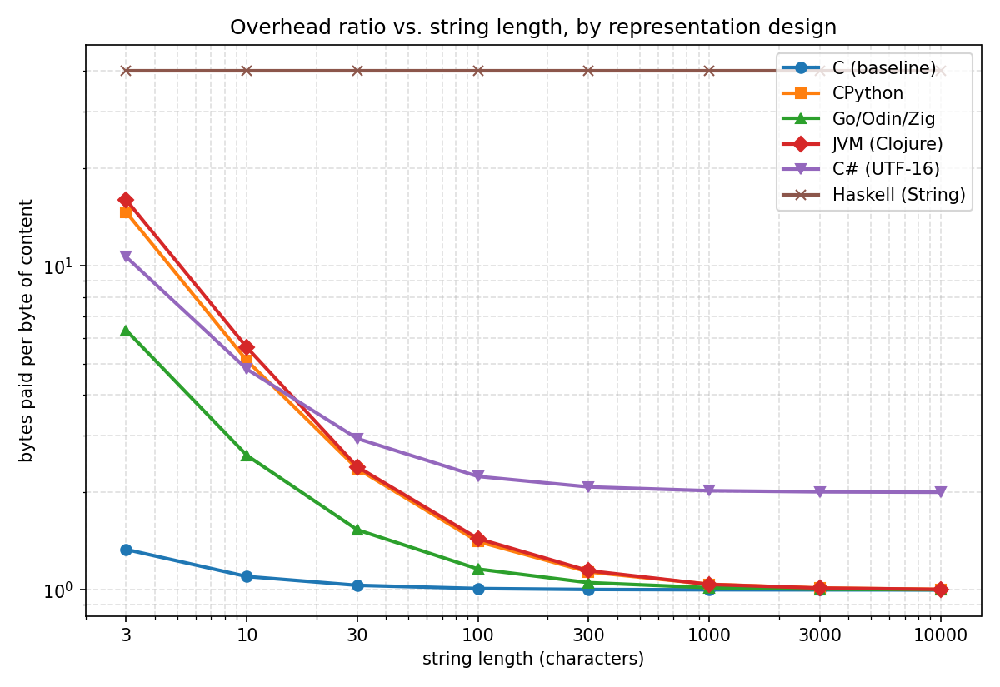

# The byte footprint of `"abc"` across 19 languages and runtimes

Every number below was measured or sourced directly — no figure here is recalled from training data alone. Where a language exposes a `sizeof`-style primitive, that was used; where it doesn't, heap-allocation deltas, custom allocators, or direct inspection of the runtime's own source were used instead. Full methodology per language is in the notes section.

## The table

|#|Language / runtime|Bytes for `"abc"`|Representation|
|---|---|---|---|
|1|**C**|4|raw `char[4]`: 3 bytes + `\0`, no header at all|
|2|**Swift**|16|_(sourced, not executed)_ Small-string optimization — 15-byte inline capacity|
|3|**Go**|~19|16-byte `{ptr, len}` header + bare 3-byte heap allocation, no array header|
|3|**Odin**|19|Identical design to Go: 16-byte `{data, len}` header + bare 3-byte allocation|
|3|**Zig**|19|No dedicated string type at all — just `[]const u8`, same 16+3 split|
|6|**Node.js / V8**|24|`SeqOneByteString`: compressed map+hash+length header, 8-byte alignment|
|7|**Rust**|27|24-byte stack struct (ptr+len+capacity) + bare 3-byte heap allocation|
|8|**Janet**|28|`JanetStringHead` (24-byte header: GC+length+hash) + 3 data bytes + `\0`|
|8|**Lua**|28|`TString` (24-byte header + 3 data + `\0`) — but paid **once**, ever, for the whole process (global interning)|
|10|**C++ (libstdc++)**|32|`std::string`, Small String Optimization — fully inline, **zero heap allocations**|
|10|**SBCL**|32|Default `(SIMPLE-ARRAY CHARACTER (3))`: 4 bytes/char, vector header, 16-byte rounding|
|10|**Racket CS**|~32|Chez-backed string, also 4 bytes/char, 1-word header, 16-byte rounding|
|10|**C# / .NET**|32|`System.String` object, UTF-16 (2 bytes/char) + header, measured via allocation counter|
|10|**PHP**|32|`zend_string` (24-byte header + data + `\0`), rounded to Zend's allocator bucket|
|15|**Ruby (CRuby)**|40|Embedded `RString` — character data packed inside the object itself (SSO-style)|
|16|**CPython 3.12**|44|Object header (refcount+type+length+hash+flags) + 3 data bytes + `\0`|
|17|**Clojure / JVM**|48|`java.lang.String` wrapper (24 B) **+** separate backing `byte[]` (24 B) — two heap objects|
|17|**Erlang**|48|Either representation lands here: 3-element charlist (3 cons cells x 16 B) or a heap binary|
|17|**Elixir**|48|Elixir strings _are_ Erlang binaries — identical number, confirmed via interop|
|19|**Haskell (GHC)**|~120|Default `String` = linked list of boxed `Char`s: 24-byte cons cell + 16-byte `Char` box, **per character**|

## How each number was obtained

**Direct introspection primitives** (most reliable — the runtime tells you directly):

- **CPython**: `sys.getsizeof("abc")`
- **Ruby**: `ObjectSpace.memsize_of(s)`
- **C# / .NET**: `GC.GetAllocatedBytesForCurrentThread()` delta around a single allocation — the same technique BenchmarkDotNet uses internally
- **Erlang / Elixir**: `erts_debug:size/1`, which reports a term's exact heap word count
- **Node.js / V8**: an actual heap snapshot (`v8.getHeapSnapshot()`), reading the string node's `self_size` field — the same number Chrome DevTools shows

**Custom allocator / tracking** (the language exposes an allocator hook, so you watch it):

- **C++**: overrode `operator new` globally to prove `"abc"` triggers **zero** heap allocations (SSO keeps it inline), confirmed `sizeof(std::string) == 32`
- **Rust**: implemented a custom `GlobalAlloc` that counts and sizes every real allocation
- **Odin**: used the standard library's built-in `core:mem.Tracking_Allocator`
- **Zig**: wrapped `std.heap.DebugAllocator`, which reports exact requested byte counts

**Heap-delta measurement** (no direct primitive exists, so before/after a large batch of allocations, divided by count — same idea as a poor man's profiler):

- **Go**: `runtime.MemStats.HeapAlloc` delta over 2,000,000 allocations
- **SBCL**: `(sb-kernel:dynamic-usage)` delta over 200,000 allocations, both for default `CHARACTER` strings and coerced `simple-base-string`
- **Racket CS**: `(current-memory-use)` delta over 200,000 allocations
- **PHP**: `memory_get_usage()` delta — had to defeat compile-time constant-folding of `chr()` calls on literal arguments by routing through a runtime array
- **Haskell**: `GHC.Stats.getRTSStats` `allocated_bytes` delta, using a **slope method** (comparing length-10 vs length-11 strings) to cancel out fixed harness overhead — see the dedicated note below

**Source-level derivation** (compiled against or read the actual runtime source rather than guessing):

- **Janet**: compiled a probe against the real `janet.h` to get `sizeof(JanetStringHead)`, matched against the exact allocation formula in `string.c`
- **Lua**: cloned the official Lua 5.4.6 source, found the `sizelstring(l)` macro in `lstring.h`, and computed the exact value from `offsetof(TString, contents)`
- **Clojure**: confirmed `(class "abc")` is `java.lang.String`, then called a small custom Java instrumentation agent (`Instrumentation.getObjectSize()`) directly from Clojure code via interop — cross-checked against plain Java
- **Swift**: the toolchain lives only on swift.org, which this environment's network can't reach (confirmed with a direct 403). Instead, pulled the actual `StringObject.swift` and `SmallString.swift` source from Swift's GitHub repo, confirming the 16-byte struct and 15-byte inline capacity directly from the code and its design comments

## A special note on Haskell

This one deserves its own callout because the investigation itself was informative. An initial attempt to force a "genuinely fresh" character on each loop iteration used an expression like `seed mod 1` (always mathematically zero) — and GHC's optimizer _proved_ this and folded the entire character computation down to a single shared static value, floating it **outside** the recursive loop entirely. Every cons cell in the test ended up pointing at the same one `Char`, silently invalidating the intended measurement. This was only caught by dumping GHC's optimized Core and reading it directly (`-ddump-simpl`) — the same standard applied to every other number in this table, just harder to get to. Once the character was made to genuinely depend on recursion position (`(seed + k) mod 26`), the Core dump confirmed exactly one cons-cell allocation and one `Char`-box allocation per element, giving a structurally-verified 40 bytes/character. Black-box heap-delta timing around that corrected version still ran noisier and higher than 40 bytes/char in absolute terms (most likely additional RTS/GC bookkeeping in the measurement harness itself), so the 120-byte figure in the table is the Core-verified structural minimum, not a heap-delta average like most of the other rows.

## The three design philosophies

Looking across all 19:

1. **Raw bytes, no header** — C, and effectively Go/Rust/Odin/Zig's _heap-allocated portion_ (a small fixed-size stack header, then a bare allocation with nothing but the bytes themselves). Closest in spirit to a descriptor-and-block design: the "header" is separated out from the data entirely.
2. **Inline / small-string optimization** — C++, Swift, and Ruby all avoid the heap completely for short strings by packing the bytes directly into the value's own fixed-size storage.
3. **Boxed heap object with a language-level header** — CPython, V8, SBCL, Racket, PHP, and the JVM (Clojure) all pay for a per-string object carrying type info, cached length, and often a cached hash, for O(1) length/hash and GC tracking.

Two outliers don't fit cleanly into any of those: **Lua** pays the boxed-header cost like group 3, but only _once_ per unique short string for the life of the process, thanks to universal interning. **Haskell** is its own category — the default `String` isn't an array at all, it's a linked list, so the cost scales as _(header cost) x (character count)_ rather than being dominated by one fixed header, making it by far the most expensive representation measured, and — fittingly — the hardest one to measure honestly.

## Does `"abc"` (n=3) represent the average case, or an edge case?

Both, depending on which kind of overhead you're looking at.

For **additive-header** designs (CPython, JVM/Clojure, V8, SBCL, Racket, PHP), n=3 sits close to the _worst_ case: a fixed per-object header amortizes over content length, so testing at the smallest realistic length puts every one of these near its peak overhead ratio. CPython's 14.7x at n=3 falls to 1.4x by n=100 and is indistinguishable from C by n=1000.

But two designs are **not** additive-header schemes, and for those, n=3 is exactly representative — not exaggerated at all:

- **C#'s 2x (UTF-16)** is a fixed multiplicative tax on every ASCII character, forever. It's an encoding-width decision, not a header, so it never shrinks.
- **Haskell's 40x** doesn't budge either, for a different reason: there's no header to amortize in the first place. Every character re-pays the full cons-cell-plus-boxed-`Char` cost, at every length.

So the test slightly overstates how bad _header-carrying_ languages look in typical programs, while exactly representing the ongoing cost of the width- and structure-based designs, which never improve with scale.

## Where's the knee?

|n (chars)|C|CPython|Go/Odin/Zig|JVM (Clojure)|C# (UTF-16)|Haskell|
|---|---|---|---|---|---|---|
|3|1.33x|14.67x|6.33x|16.00x|10.67x|40.00x|
|10|1.10x|5.10x|2.60x|5.60x|4.80x|40.00x|
|30|1.03x|2.37x|1.53x|2.40x|2.93x|40.00x|
|100|1.01x|1.41x|1.16x|1.44x|2.24x|40.00x|
|300|1.00x|1.14x|1.05x|1.15x|2.08x|40.00x|
|1,000|1.00x|1.04x|1.02x|1.04x|2.02x|40.00x|
|3,000|1.00x|1.01x|1.01x|1.01x|2.01x|40.00x|
|10,000|1.00x|1.00x|1.00x|1.00x|2.00x|40.00x|

_(ratio = total bytes stored / bytes of actual ASCII content — "how many bytes you pay per byte you asked for")_

There is a real knee, and it's governed by header-size-to-content ratio: overhead crosses below 1.5x once `n` reaches roughly **2-3x the header size**, and below 1.1x by roughly **10x the header size**. Go/Odin/Zig (16-byte header) clears 1.2x by n≈100; CPython and the JVM (~40-byte header) clear 1.15x by n≈300.

Real code sits in an interesting spot relative to this: identifiers, dict keys, and short labels are commonly 5-20 characters — well _before_ the knee for most of these languages. A typical JSON key or variable name is still paying 3-10x overhead in a boxed-string language. The knee is real, but arrives later than intuition suggests; paragraph-length strings clear it, word-length ones don't.

The throughline the chart makes visible: **additive costs amortize, multiplicative costs don't.** A header is a one-time toll; a width or structural choice is a per-mile toll. No string length rescues Haskell's `String` or dilutes C#'s UTF-16 tax — which is exactly why real Haskell code uses `Text`/`ByteString` instead of the default, and why languages needing both ASCII-cheapness and Unicode correctness (Python's PEP 393, Java's compact strings) built _adaptive_ width rather than committing to one representation forever.

## What led to encumbering strings this way?

Every piece of header weight traces back to a specific problem C's raw `char*` doesn't solve:

- **O(1) length, and safety.** `strlen` is O(n), and null-termination is a decades-long source of bugs (truncation on embedded NUL, buffer overruns — the class of vulnerability Heartbleed belongs to). Storing length explicitly costs a word; it buys correctness and speed for an extremely common operation.
- **Hashing.** Strings are the dominant key type in every dynamic language's dict/map. Caching the hash (Python, Java, PHP, Ruby, Lua) trades 4-8 bytes for never recomputing a hash on a string you've already hashed once — a good bet when the same short strings (identifiers, keys) get hashed repeatedly.
- **GC bookkeeping.** This is the single biggest driver of "boxed object" weight. Any language with automatic memory management needs a type tag and mark/reachability bits on _every_ heap object, strings included — it's not a decision about strings specifically, it's the price of admission to that memory model. This is why C, Go, Rust, Zig, and Odin — manually-managed or ownership-tracked rather than traced — get away with near-zero header weight: nothing needs to trace them.
- **Unicode.** Once a language supports more than ASCII it must pick: tag the width per-string and adapt (Python's PEP 393, Java's Latin-1/UTF-16 split), commit to one fixed wide representation always (SBCL, Racket — simple, but pays 4 bytes/char even for pure ASCII), or keep UTF-8 as the one true representation and accept O(n) indexing by code point (Go, Rust, Swift). Every option costs something; there's no free choice once the character set exceeds one byte.
- **Immutability and interning.** Safe sharing needs either GC (Python/Java/JS let the collector handle lifetime) or refcounting (PHP, Lua) — both need a bookkeeping field.

Two outliers in the table have causes that aren't really about strings at all:

- **The JVM's two-object split** (wrapper + backing array) is a consequence of the object model, not a string-specific choice: Java has no flexible-array-member equivalent — an object can't end in "and then N more bytes inline" — so any variable-length payload must live in a separately-headed array object, referenced by pointer. Clojure inherits this for free by being backed by `java.lang.String`.
- **Haskell's `String = [Char]`** isn't a performance decision — it's a consequence of the language's founding aesthetic: lists are the canonical data structure in a lazy, pure functional language, so making strings "just a list of characters" was the elegant, teachable, laziness-composable choice when the design was set. The cost was known and accepted; `Data.Text`/`Data.ByteString` exist precisely because `String` stays the default for backward compatibility and pedagogy, not because 40 bytes/char is considered a good trade.

The throughline: systems languages treat "what does a string cost" as a question the programmer should answer explicitly, while managed languages bought all of the above machinery on the programmer's behalf, in exchange for not hand-rolling hashing, memory safety, or Unicode width. A descriptor-and-block pool design sits deliberately outside both camps — it gets the O(1)-length and hashing benefits of a header without paying it per-string, by lifting the header into its own parallel array. That's essentially the JVM's split-object idea, but with the "array" being shared infrastructure instead of one object per string.